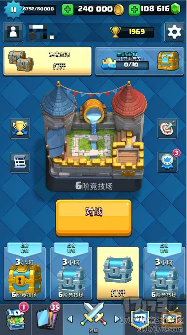
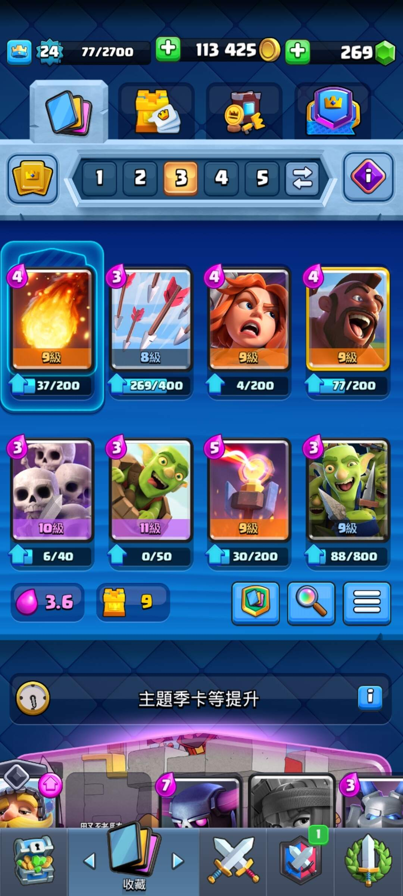
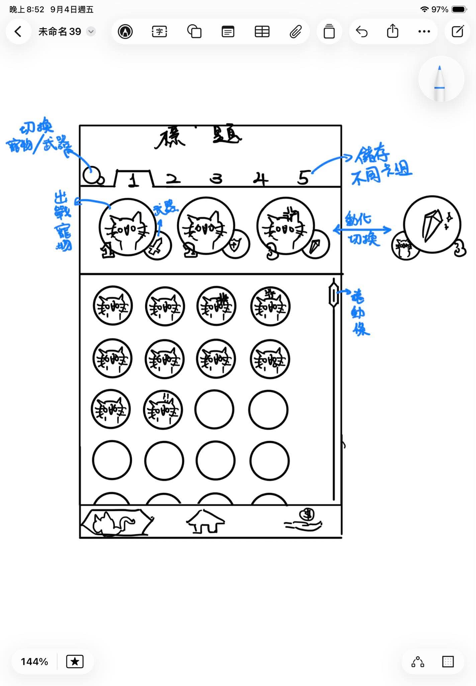
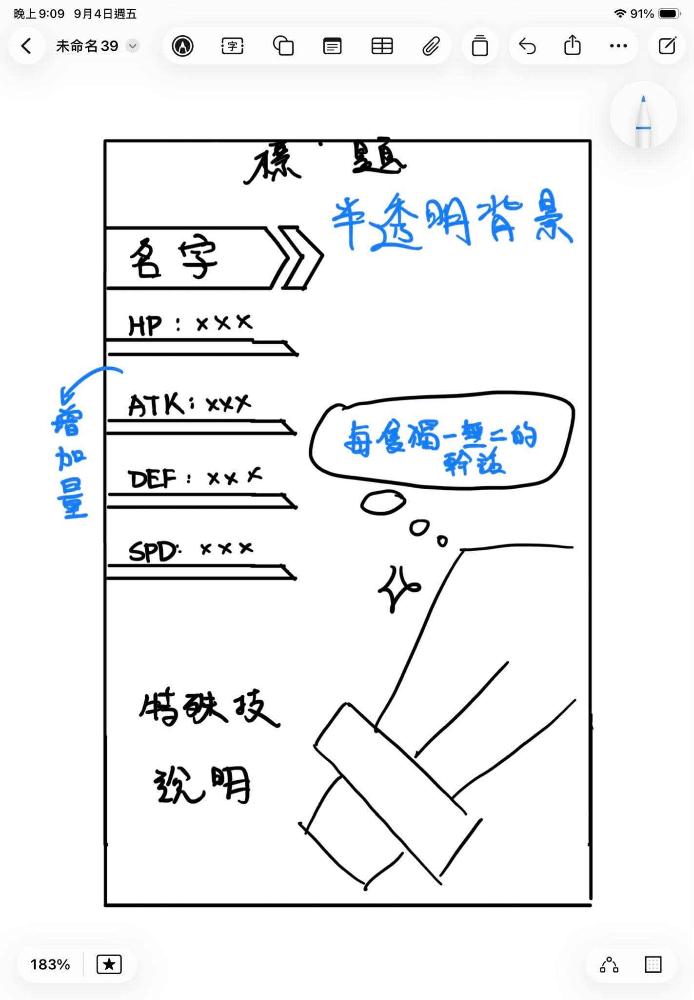
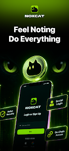

# FUTUREMODE 遊戲文檔

## 目標
該公司的目標是透過這個 Hackathon 找到能夠被放在自家產品中的小遊戲。
NOXCAT 做電子錢包與區塊鏈，因此我們期望資料存儲方式與此有相容性。
> Feel Nothing. Do Everything.
NOXCAT 口號

## 要求
有以下硬性要求：
- NOXCAT 本身需要是主角
- 十秒鐘內能夠簡單易懂的開啟遊戲
- 支援手機 + 單指操作
- 一局結束以後會願意再開一局

## 技術實現
DEMO 以以下技術實現：
- 詳見 architecture.md

## 遊戲核心
集換式怪物彈珠遊戲。
玩家會透過利用寵物挑戰地下城獲得道具 (新寵物、武器、道具、特效等)
若寵物在戰鬥中死亡，會留在地下城內，作為所有人可能通關的獎勵。

## 遊戲細項規則
遊戲需要幾個重要畫面：
1. 主畫面，也是進入戰鬥的畫面。目的是要快速開局。
2. 寵物列表。顯示目前所持有的所有寵物，所持道具。可以調整出戰對伍編組。提供觀賞模式，獨一無二的對話與數值詳細度。
3. 戰鬥畫面。以怪物彈珠式戰鬥的地點。
4. 交易所。可以交易物品。

### 主畫面
主畫面配置參考皇室戰爭主畫面：

中間會顯示當前關卡，可以通過上下滑動決定關卡。
中下方有個出戰按鈕可以進入遊戲。
向左滑動進入左方的寵物列表頁面。
向右滑動進入右方的交易介面。

### 寵物列表

上半部分會顯示目前已編入出戰對伍的三個位置，顯示寵物以及其攜帶物品。
下方則會依據不同分頁顯示不同內容
若在寵物分頁，則可以透過拖曳或雙擊的方式進入隊伍的位置中。(若雙擊寵物，自動放入隊伍空格，無空格則跳出隊伍已滿提示)
若在道具分頁，則可以調整每隻寵物所要攜帶的道具是甚麼。

另外，若在這些頁面中點擊道具或寵物，則可以進入觀賞模式。觀賞模式也會顯示詳細數值與角色內容，可以利用道具升級。

### 交易介面
上方有兩個tab可選：
1. 交易所
指定玩家，向他發起一項以物易物的請求。
按下左下角加號發起新請求，輸入對方玩家 ID 、交易雙方提供物品則可以送出請求。對方如果通過交易自動完成。請求宣告支付的物品會暫時鎖定，直到交易成功或取消。
2. 走失列表
該列表顯示所有戰敗而掉落的寵物和武器的狀態。顯示當前掉落位置，或被誰撿走的。提供撿走者的 ID 供發起交易請求。

## 美術風格
像素風，因為原本的畫風太難製作。
UI 參考 NOXCAT 錢包的簡約黑+亮綠色+白字風格。
