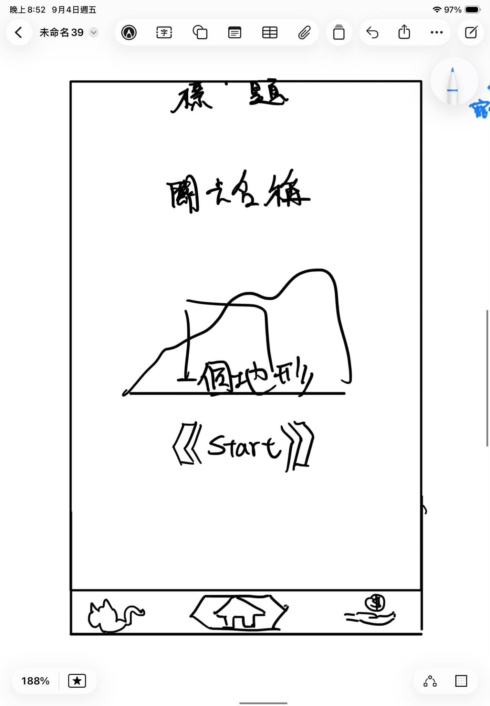
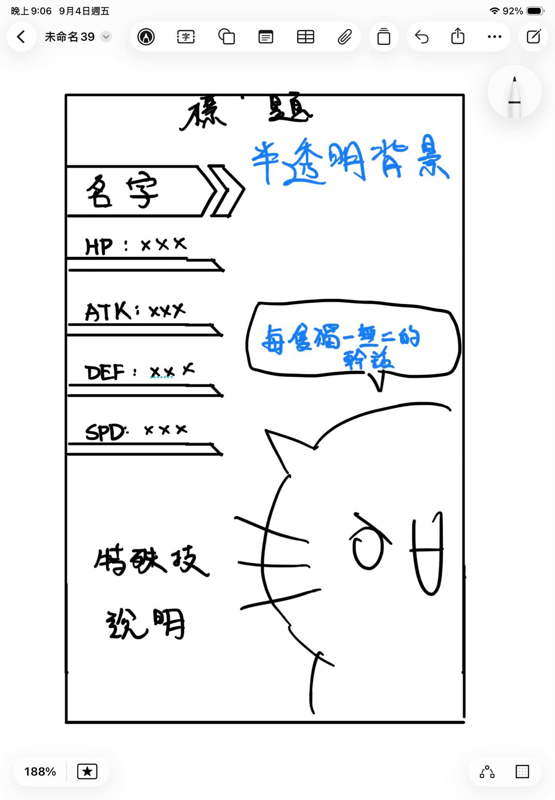
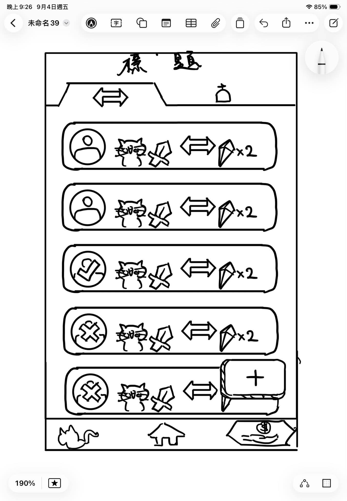
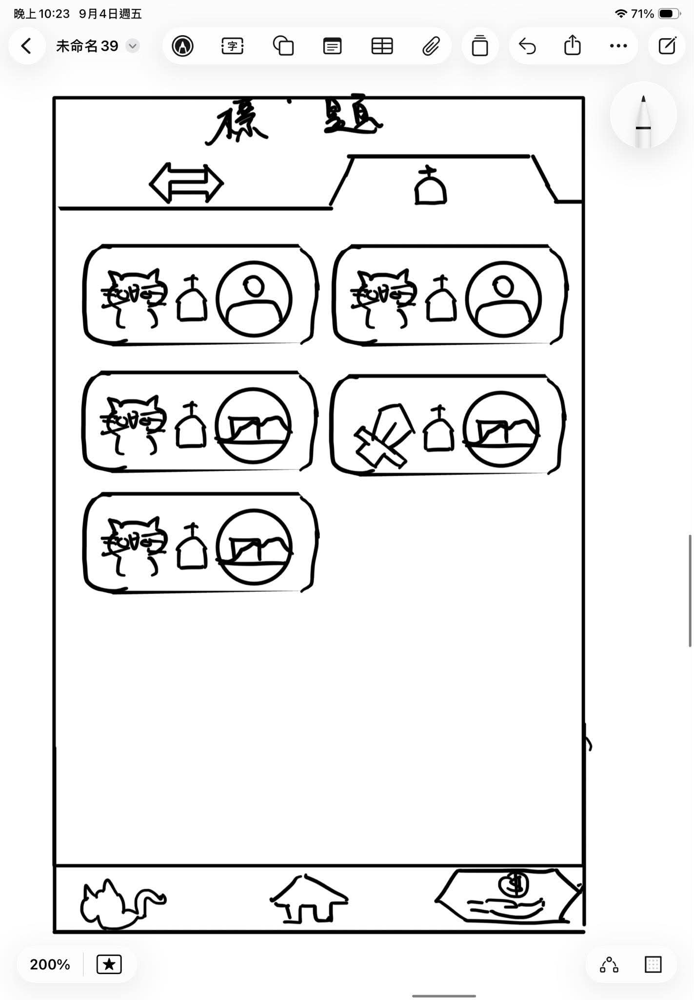
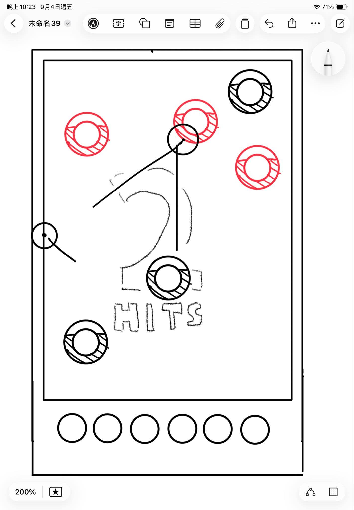
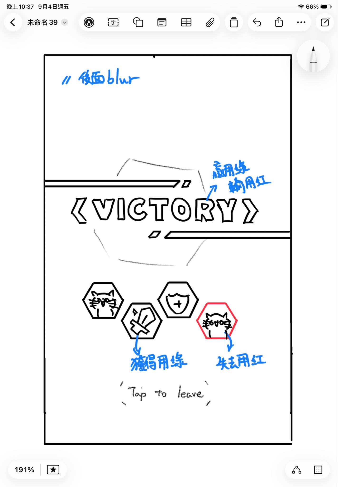

# FUTUREMODE 遊戲文檔

## 目標
該公司的目標是透過這個 Hackathon 找到能夠被放在自家產品中的小遊戲。
NOXCAT 做電子錢包與區塊鏈，因此我們期望資料存儲方式與此有相容性。
> Feel Nothing. Do Everything.
NOXCAT 口號

## 要求
有以下硬性要求：
- NOXCAT 本身需要是主角
- 十秒鐘內能夠簡單易懂的開啟遊戲
- 支援手機 + 單指操作
- 一局結束以後會願意再開一局

## 技術實現
DEMO 以以下技術實現：
- 詳見 architecture.md

## 遊戲核心
集換式怪物彈珠遊戲。
玩家會透過利用寵物挑戰地下城獲得道具 (新寵物、武器、道具、特效等)
若寵物在戰鬥中死亡，會留在地下城內，作為所有人可能通關的獎勵。

## 遊戲細項規則
遊戲需要幾個重要畫面：
1. 主畫面，也是進入戰鬥的畫面。目的是要快速開局。
2. 寵物列表。顯示目前所持有的所有寵物，所持道具。可以調整出戰對伍編組。提供觀賞模式，獨一無二的對話與數值詳細度。
3. 戰鬥畫面。以怪物彈珠式戰鬥的地點。
4. 交易所。可以交易物品。
5. 結算介面。在戰鬥畫面結束時出現，顯示勝利或失敗、獲得與失去哪些寵物或物品。

### 主畫面
主畫面配置參考皇室戰爭主畫面：

中間會顯示當前關卡，可以通過上下滑動決定關卡。
中下方有個出戰按鈕可以進入遊戲。
向左滑動進入左方的寵物列表頁面。
向右滑動進入右方的交易介面。

下方有頁面導覽列。

### 寵物列表

上半部分會顯示目前已編入出戰對伍的三個位置，顯示寵物以及其攜帶物品。
下方則會依據不同分頁顯示不同內容
若在寵物分頁，則可以透過拖曳或雙擊的方式進入隊伍的位置中。(若雙擊寵物，自動放入隊伍空格，無空格則跳出隊伍已滿提示)
備註：這代表若一個寵物或道具被長按以後，其他除了三個隊伍位置以外的地方需要變灰，使拖曳目的地明顯。若拖曳到已經有寵物的位置，則取代其在出戰隊伍中的位置，並取消原本那個寵物的已選擇狀態。在隊伍中的寵物或道具要顯示一個綠色的勾勾代表已入隊。
若在道具分頁，則可以調整每隻寵物所要攜帶的道具是甚麼。道具的操作基本同寵物。

另外，若在這些頁面中點擊道具或寵物，則可以進入觀賞模式。觀賞模式也會顯示詳細數值與角色內容。
觀賞模式內容：

### 交易介面
上方有兩個tab可選：
1. 交易所
指定玩家，向他發起一項以物易物的請求。
按下左下角加號發起新請求，輸入對方玩家 ID 、交易雙方提供物品則可以送出請求。對方如果通過交易自動完成。請求宣告支付的物品會暫時鎖定，直到交易成功或取消。

已經發起的交易會顯示Pending(無改變)、Accepted(對方的頭像上有綠色勾勾)、Rejected(對方的頭像上有紅色叉叉)。
2. 走失列表
該列表顯示所有戰敗而掉落的寵物和武器的狀態。顯示當前掉落位置，或被誰撿走的。提供撿走者的 ID 供發起交易請求。

僅能看到掉落在哪個關卡或撿走者的 ID。

### 戰鬥介面
參見已經 vibe 出來的東西。

類似怪物彈珠的戰鬥模式：首先依據角色的速度值排序移動順序。每次一個寵物或敵人移動時，點擊並拖曳決定彈射方向與力度。放開手指即成功發射，撞擊隊友和敵人。撞擊到敵人會對其造成傷害。行動完成以後，與伺服器同步資料並將其速度-50使其退後操作序。

### 結算介面
模糊化戰鬥介面以後顯示，大大的顯示戰鬥結果，並在下方綠色或紅色的六邊形中顯示獲得與失去什麼東西。

若寵物死亡會失去寵物以及其攜帶的道具(除非是回家代幣)。該寵物或道具會被記錄在該關卡的掉落物中，其他挑戰此關卡的人有機會在獎勵中得到該寵物或道具。你勝利獲得的道具或寵物也可能是其他人掉落的。

## 美術風格
像素風，因為原本的畫風太難製作。
UI 參考 NOXCAT 錢包的簡約黑+亮綠色+白字風格。

大圖 256\*256、小圖 128\*128
寵物與道具的圖片由AI生成，其他靠程式畫。

## 未來期許
1. PVP
勝者贏走敗者的寵物或物品
2. Boss關
3. 特殊機制
4. 隨機生成寵物圖片、說明、基礎數值
5. 升級選項
6. 特效符文
7. NOX 代幣銜接
